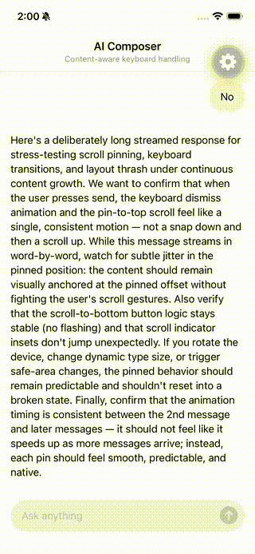

# expo-ai-chat

Monorepo for **expo-ai-composer** — a native keyboard-aware AI composer component for React Native.

## Packages

### [`expo-ai-composer`](./expo-ai-composer)

A native keyboard-aware AI composer for React Native with smooth system-level keyboard animations and ChatGPT-style pin-to-top scroll.

<table>
<tr>
<td width="50%" align="center">

<br/><b>First message + streaming</b>
</td>
<td width="50%" align="center">

<br/><b>Pin-to-top + keyboard</b>
</td>
</tr>
</table>

#### Features

- Native keyboard tracking (iOS + Android)
- ChatGPT-style pin-to-top scroll with runway for streaming
- Auto-growing multiline text input
- Built-in send/stop buttons with haptic feedback
- Scroll-to-bottom FAB
- Customizable accessory slots (header, leading, trailing, footer)
- Transparent background — style from React Native
- Expanded full-screen editor (iOS)
- Imperative ref methods (`focus`, `blur`, `clear`)
- First-message slide animation support

#### Quick Start

```bash
npx expo install expo-ai-composer
```

```tsx
import { AiComposer, AiComposerWrapper, constants } from "expo-ai-composer";
```

See the full [API documentation](./expo-ai-composer/README.md).

### [`app`](./app)

Ejected Expo test app for developing and testing the module.

```bash
pnpm install
cd app && npx expo run:ios --port 8083
```

## Structure

```
expo-ai-chat/
├── app/                    # Ejected Expo app (SDK 55, RN 0.83.4)
│   ├── ios/                # Native iOS project
│   ├── android/            # Native Android project
│   └── App.tsx             # Test chat screen
├── expo-ai-composer/       # The native module
│   ├── ios/                # Swift (8 files)
│   ├── android/            # Kotlin (6 files)
│   ├── src/                # TypeScript API (5 files)
│   └── README.md           # Full API docs
├── package.json            # Workspace root
└── pnpm-workspace.yaml
```

## Development

```bash
# Install dependencies
pnpm install

# Run iOS
cd app && npx expo run:ios --port 8083

# Run Android
cd app && npx expo run:android --port 8083

# Build module TypeScript
cd expo-ai-composer && npx expo-module build
```

## License

MIT
